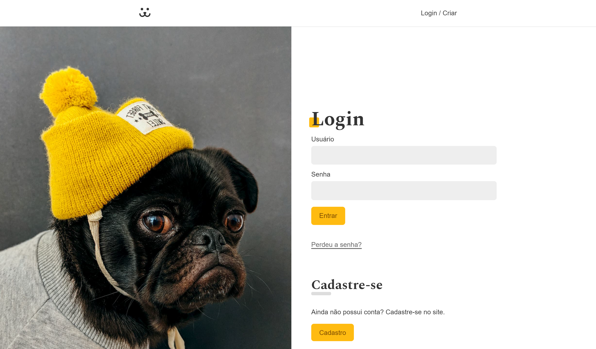

# Projeto PetGram



## 💭 Descrição

Este projeto trata-se de uma rede social para pets desenvolvida como parte do curso da Origamid. O projeto foi criado com o objetivo de aprimorar as habilidades em React e integração com APIs.

## 🧠 Funcionalidades

✔️ **Registro de Usuários** - Os usuários podem criar uma conta na rede social.

✔️ **Autenticação de Usuários** - Os usuários podem fazer login na plataforma para acessar suas contas..

✔️ **Recuperação de Senha** - A rede social oferece a funcionalidade de recuperação de senha.

✔️ **Postagem de Fotos** - Os usuários podem compartilhar fotos de seus pets na rede social.

✔️ **Feed de Atividades** - Os usuários podem visualizar o feed de atividades, que exibe as postagens e interações mais recentes dos amigos. 

✔️ **Comentários** - Os usuários podem interagir com as postagens por meio de comentários.

✔️ **Exclusão de Fotos** - Os usuários têm a capacidade de excluir suas próprias fotos.

✔️ **Estatísticas da Aplicação** - Os usuários podem acessar estatísticas da aplicação. 

## 🖥️ Tecnologias Utilizadas

- [React](https://react.dev) - biblioteca para interfaces de usuário
- [React Router Dom](https://reactrouter.com/en/main) - é uma biblioteca de roteamento que permite criar rotas e navegação de página.
- [Vite](https://vitejs.dev) - ferramentas para front-end
- [Typescript](https://www.typescriptlang.org) - superset, linguagem baseada em javascript
- [CSS](https://developer.mozilla.org/pt-BR/docs/Web/CSS) - é uma linguagem de estilo.

## 🛠️ Modificando o projeto

### Siga as seguintes instruções para instalar e poder modificar o projeto em sua máquina:

### 📋 Pré-requisitos:

Para baixar, executar e modificar o projeto, você precisa ter instalado em sua máquina:

- [Node](https://nodejs.org/en)
- Um gerenciador de pacotes, como o [PNPM](https://pnpm.io), [Npm](https://nodejs.org/en/) ou [Yarn](https://classic.yarnpkg.com/lang/en/docs/install)
- [Git](https://git-scm.com/downloads)
- Editor de código ou IDE, como o [VSCode](https://code.visualstudio.com/Download)

### 🔧 Instalação e execução

1. Clone o repositório

```bash
git clone https://github.com/aleretamero/petgram.git
```

2. Acesse a pasta do projeto

```bash
cd petgram
```

3. Instale as dependências

```bash
npm install
# ou
pnpm install
# ou
yarn install
```

4. Inicie o servidor de desenvolvimento do projeto

```bash
npm run dev
# ou
pnpm dev
# ou
yarn dev
```

5. Crie um arquivo .env na raiz do projeto e nele você coloca VITE_API_URL="https://dogsapi.origamid.dev/json" 

Obs: o servidor iniciará na porta 5173 - acesse por: <http://localhost:5173/>

## Colaboradores 🤝🤝

| Foto                                                       | Nome                                                 |
| ---------------------------------------------------------- | ---------------------------------------------------- |
|  | [Alexandre Retamero](https://github.com/aleretamero) |

## Licença

[MIT](https://choosealicense.com/licenses/mit/)

